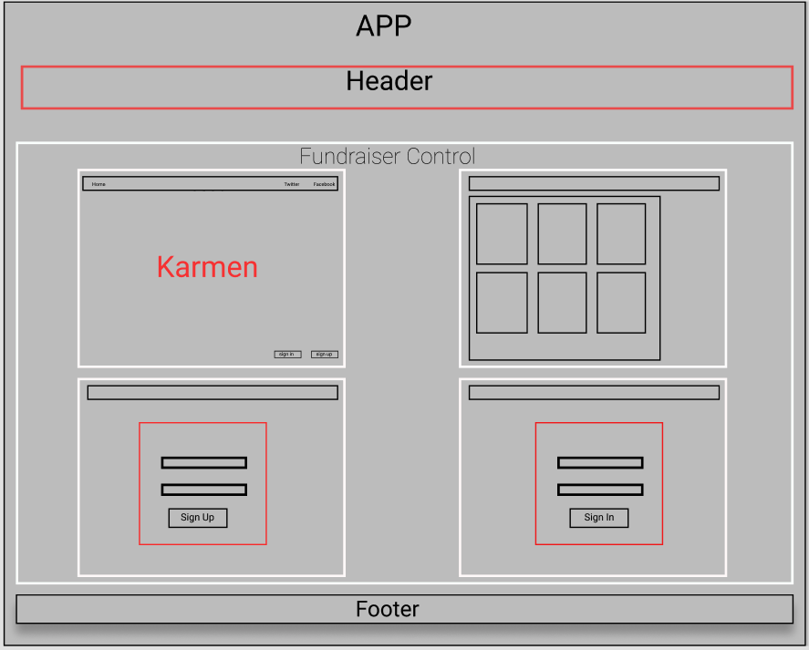

# Karmen

### Capstone

### By Allison Sadin

## Description
Karmen is an application developed to help users feel more secure when they choose to donate money for a cause. With a recent rise in fundraising, there has also been an increase in fraudulent fundraisers and donation based organizations. This application allows users to login through facebook and twitter, then verify different fundraisers with the click of a button. This way, users can see fundraisers their friends verified, or perhaps a local activist they follow on social mediea, and feel confident that the fundraiser is not a fake. 

<br><br>

# Capstone Proposal

### Allison Sadin

### Karmen

## Description
An application that allows a user to search, based on a location and filters for fundraising opportunities. This application would allow people to verify the legitimacy of a fundraiser by adding a stamp of approval so that friends and followers are able to feel confident in their donation. 

## Use Case
The users of this application would be anyone looking to make a donation to a cause or post a fundraiser for a cause. This application will help organize fundraisers based on location and type so they are easily searchable. With the ease of access to and creation of fundraisers, many fraudulent fundraisers have taken advantage of people’s generosity. This app would allow users to verify the legitimacy of fundraisers that they know are not fraudulent. Not all fundraisers need to be verified to be posted, but if a fundraiser is verified then it will show some indication of that (similar to the blue check mark that appears next to a celebrity instagram account). So as an example: if you follow someone on instagram, facebook, tiktok, etc.  and know they are fighting for a certain cause, they could endorse a fundraiser so the user looking to donate knows they can trust that fundraiser. It will also have search capabilities so that a user can search for local or national fundraisers.


## Minimum Viable Product

* Allow users to make posts of fundraisers with links to the fundraising page
* Allow users to use firebase authentication with Twitter and Facebook
* Allow users to select keywords for their post so that other users are able to narrow down a search.
* Use flags in one of the document collections that users can add via checkboxes, but the user    wont see these, they will purely be to query for related fundraisers.
* Allow users to verify fundraisers

## Tools for MVP

* Javascript
* Bootstrap
* React/Redux 
* Databases
* Firebase/Firestore


## Additional Features

* Allow users to make their own personal profile and list fundraisers they promote
* Allow users to report  to have them taken down fraudulent fundraisers
* Allow posts to be flagged as fraudulent
* Allow users to link their social media accounts and display profile picture
* Connect GoFundme API
* Add pagination
* Push fundraisers that have reached their goal towards the bottom and ones that havent to the top
 

## Tools for Additional Features
* Twitter/Facebook API that allows developer to use profile information
* GoFundMe API 

 
## Additional Information
Using firebase I am able to use their authentication feature with twitter and facebook, so that is what I will be working to complete. There is a review process and you must submit your project to both twitter and facebook for approval. I plan to continue my work with Karmen to complete my MVP so that users have a search option and are able to verify fundraisers properly.

<br>

# User Stories
*  Users can create an account using their email and a password, or the user can login through a facebook or twitter pop up page.
*  Users can scroll through different fundraisers created by other users.
*  Users can add their own fundraisers.
*  Users can search fundraisers based on location.
*  Users who are logged in through facebook or twitter can "verify" fundraisers to let people know they are legitimate.
<br>

## Diagram



<br>

## Components


<br>


<br>


<br>

## Set Up/Installation

Clone The Project

1.  Navigate to the [Karmen respository](https://github.com/aesadin/Karmen2.git) and copy the project's URL.

2. Clone this project using the GitHub command:
`$ git clone https://github.com/allison-sadin/karmen.git`

3. Navigate to the newly created `karmen` directory in [Visual Studio Code](https://code.visualstudio.com/) or another editor.

4. Create a .env file in the root directory of karmen. This is where private keys will be stored. The .env file has already been added to the .gitignore file of this repository. Make sure to commit this before copying the private keys into the .env file, otherwise they will be pushed to github.

5. Next, go to the [Google Firebase](https://firebase.google.com/). Create an account or login if you already have one. Click the "Create a Project" button, add the project name "karmen", then click the `</>` symbol to add firebase to a new web application. You will then be given a configuration: 
  ```
  var firebaseConfig = {
    apiKey: "YOUR-UNIQUE-CREDENTIALS",
    authDomain: "YOUR-PROJECT-NAME.firebaseapp.com",
    databaseURL: "https://YOUR-PROJECT-NAME.firebaseio.com",
    projectId: "YOUR-UNIQUE-PROJECT-NAME",
    storageBucket: "YOUR-UNIQUE-URL",
    messagingSenderId: "YOUR-UNIQUE-CREDENTIALS",
    appId: "YOUR-UNIQUE-APPID"
  };
  ```

6.  Next, create a database by clicking on the "Database" tab in the "Develop" side panel on the left side of the console and then click "Create database". Do not use a realtime database, choose the firestore database.

7. In your .env file, copy and paste your keys from firebase. The keys must be stored as follows, in all capitals, starting with REACT_APP.
  ```
  REACT_APP_FIREBASE_API_KEY = "YOUR-UNIQUE-CREDENTIALS"
  REACT_APP_FIREBASE_AUTH_DOMAIN = "YOUR-PROJECT-NAME.firebaseapp.com"
  REACT_APP_FIREBASE_DATABASE_URL = "https://YOUR-PROJECT-NAME.firebaseio.com"
  REACT_APP_FIREBASE_PROJECT_ID = "YOUR-PROJECT-FIREBASE-PROJECT-ID"
  REACT_APP_FIREBASE_STORAGE_BUCKET = "YOUR-PROJECT-NAME.appspot.com"
  REACT_APP_FIREBASE_MESSAGING_SENDER_ID = "YOUR-PROJECT-SENDER-ID"
  REACT_APP_FIREBASE_APP_ID = "YOUR-PROJECT-APP-ID"
  ```

8. Type `$ npm install` in your terminal to install all webpack plugins and libraries. 

9. Once installation is complete, type `$npm run build`, then `$ npm start` to see the project in the web browser.


## Known Bugs

There are a couple issues with this application that I intend on fixing. Fist, the sign out button does not properly logout of facebook or twitter, although it does work for the email/password authentication. The verify button on the list of fundraisers does not correctly display the gold star it is intended to, however the console does show that the function correctly grabs the star if the user is logged in with social media. 

## Support and Contact Details

If there are any issues or questions, please send an email to allisonsadin@gmail.com
<br>

## Technologies Used

*  JSX
*  CSS
*  JavaScript
*  Bootstrap 4 MDB
*  React
*  Redux
*  Firebase / Firestore
*  OAuth Facebook and Twitter Authentication
*  VS Code 

<br>

### License

*This project uses the following license: [MIT](https://opensource.org/licenses/MIT)*

Copyright (c) 2020 **_Allison Sadin_** 